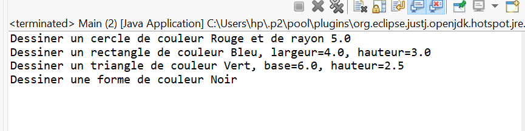
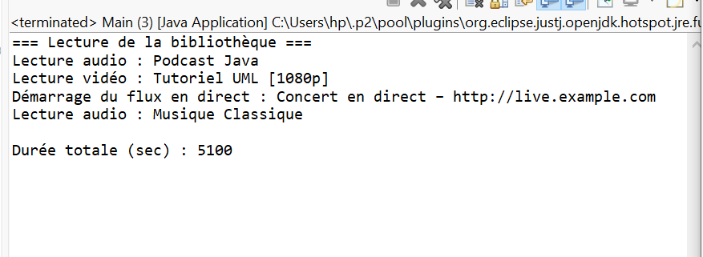
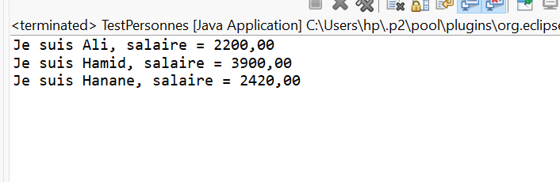

# TP 6 : Polymorphisme
#  Exercice 1 : Système de dessin de formes

##  Objectif  
Mettre en œuvre le **polymorphisme** en Java à travers une hiérarchie de classes représentant différentes formes géométriques.  
L’objectif est de démontrer la **liaison dynamique** lors de l’appel d’une méthode redéfinie (`dessiner()`).

---

##  Structure du projet
```
src/
└── exercice1/
    ├── Forme.java
    ├── Cercle.java
    ├── Rectangle.java
    ├── Triangle.java
    └── Main.java
```

###  Résultat attendu
```
Dessiner un cercle de couleur Rouge et de rayon 5.0
Dessiner un rectangle de couleur Bleu, largeur=4.0, hauteur=3.0
Dessiner un triangle de couleur Vert, base=6.0, hauteur=2.5
Dessiner une forme de couleur Noir

```
##  Exemple d’exécution (image)

Voici un exemple de l'exécution du programme (screenshot) :




#  Exercice 2 : Gestion d’une bibliothèque multimédia

##  Objectif
Mettre en œuvre **le polymorphisme en Java** en concevant une hiérarchie de classes `Media` et ses sous-classes (`Audio`, `Video`, `LiveStream`), chacune redéfinissant les méthodes `lire()` et `getDuree()`.  
Les objets seront stockés dans un même tableau pour illustrer la **liaison dynamique**.

---
##  Structure du projet

```
src/
└── com/
└── example/
└── tp/
├── Media.java
├── Audio.java
├── Video.java
├── LiveStream.java
├── MediaLibrary.java
└── Main.java

```
## Exemple de sortie
```
=== Lecture de la bibliothèque ===
Lecture audio : Podcast Java
Lecture vidéo : Tutoriel UML [1080p]
Démarrage du flux en direct : Concert en direct – http://live.example.com
Lecture audio : Musique Classique

Durée totale (sec) : 4200

```

## Exemple d’exécution (image)

Voici un exemple de l'exécution du programme (screenshot) :



---

# Exercice 3 : Personne, Développeur et Manager

##  Objectif pédagogique
Mettre en œuvre :
- L’héritage et les classes abstraites  
- Le polymorphisme via des méthodes redéfinies  
- Les génériques (`List<? extends Personne>`) pour manipuler des listes hétérogènes de sous-classes  

---

## Structure du projet
```
src/
├── ma/
│ └── projet/
│ ├── Personne.java
│ ├── Utils.java
│ └── TestPersonnes.java
│
└── ma/
└── projet/
└── bean/
├── Developpeur.java
└── Manager.java
```


 ## Exemple d’exécution
 
```
Je suis Ali, salaire = 2200.00
Je suis Hamid, salaire = 3900.00
Je suis Hanane, salaire = 2420.00

```
## Exemple d’exécution (image)

Voici un exemple de l'exécution du programme (screenshot) :


